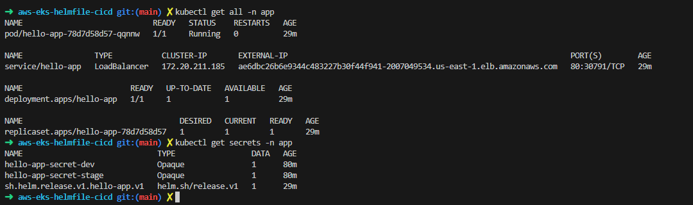

# AWS EKS Helmfile CI/CD

This repository demonstrates a Continuous Integration and Continuous Deployment (CI/CD) setup for deploying a simple application on AWS Elastic Kubernetes Service (EKS) using Helm and Helmfile.

## Overview

The application uses the `nginxdemos/hello` Docker image, which serves a basic Hello World web application. This README provides an overview of the repository structure, how to set up and deploy the application, and how to access it.

## Table of Contents

- [Features](#features)
- [Repository Structure](#repository-structure)
- [Prerequisites](#prerequisites)
- [Accessing the Application](#accessing-the-application)
- [Created resources](#created-resources)
- [License](#license)

## Features

- **CI/CD Pipeline:** Automated deployment to multiple environments (Development and Staging) using GitHub Actions.
- **Kubernetes Management:** Manage deployments using Helm and Helmfile for better configuration and versioning.
- **AWS Integration:** Utilizes AWS services to host the application on EKS with LoadBalancer services.

## Repository Structure
```bash 
/tf
├── backend.tf     # Configuration for the Terraform backend
├── eks-cluster.tf # Terraform configuration for provisioning the EKS cluster
├── main.tf        # Main entry point for the Terraform configuration
├── outputs.tf     # Outputs from the Terraform run
├── terraform.tf   # Terraform backend configuration
├── variables.tf   # Variables for parameterization
└── vpc.tf         # Configuration for the VPC
/app
├── helmfile.yaml         # Helmfile for managing Kubernetes releases
├── values                # Values files for different environments
│   ├── dev.yaml
│   └── stage.yaml
└── hello-chart           # Custom Helm chart for the application
    ├── Chart.yaml
    ├── values.yaml
    └── templates
        ├── deployment.yaml
        └── service.yaml
```

## Prerequisites

- AWS account with permissions to create EKS clusters and other necessary resources.
- `kubectl` installed and configured on your local machine.
- `Helm` and `Helmfile` installed.
- AWS CLI installed and configured.
- GitHub account for Actions and workflows.

## Accessing the Application

You can access the application by using the following URL: 

```bash 
http://ae6dbc26b6e9344c483227b30f44f941-2007049534.us-east-1.elb.amazonaws.com/
```

## Created resources

The followgin screenshot shows the status of the Kubernetes resources in the app namespace. The LoadBalancer service named hello-app is active and exposed externally. The deployment named hello-app is running with 1 replica, indicating that the pod is successfully managing the application. Additionally, there are two secrets: hello-app-secret-dev and hello-app-secret-stage, which are used to store sensitive information securely.



## License

Copyright © 2024 Brian Robles. All rights reserved.